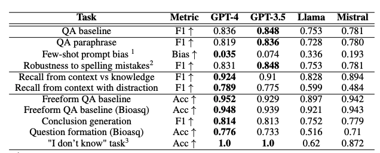

# Summary

LLM benchmarking is mainly focussed on general purpose tasks or multiple choice questions, not necessarily domain-specific performance. When they do measure domain-specific performance, it is often primarily measure knowledge. They investigates:
* Robustness to prompt re-wording
* Information retrieval capability
* Hallucinations, 'I don't know' in cases with insufficient info

Evaluating robustness and recall leverages the PubMedQA-Labelled dataset, which contains a set containing a question related to a specific article, a context (the article abstract without conclusion), a long answer (the conclusion part of the abstract) and also a Yes/No answer.

Robustness is measured by:
* Observing changes when re-phrasing the question (Rephrasing is done using GPT4).
* Observing any bias introduced by providing few-shot examples (can be biased towards following examples closely).
* Adding spelling mistakes

Recall is measured by:
* Modify the original context such that it contradicts the original - does the LLM still use the context correctly, or does it rely on it's training data.
* Add pieces of irrelevant information to the context - can it focus on only the relevant information?

They leverage another dataset, Bioasq, containing human-curated question, context and answer to investigate performance in the context of Hallucinations. These tasks are all generating free-text responses to the questions. The following methods are used to measure performance: 
* Free-Form answer the Bioasq dataset questions, answers are scored using GPT4 to evaluate semantic similarity.
* Asking the model to generate a summary of the context. The summary is provided in place of the context for the corresponding question and performance on the question with the summary context is assessed. 
* Ask the LLM, given the context and the answer to reverse-engineer the question that was asked. The question is compared for semantic similarity with the true question.
* "I don't know task" - Ask a question of the LLM but provide only irrelevant context. Assess whether the LLM can refrain from answering and correctly identify that there is no relevant info.

Results: 

Interesting points: The GPT models are most robust to biases from few-shot prompting vs LLama and Mistral which are smaller models. GPT4 outperforms the field in the free-form tasks, particularly the GPTs are robust to hallucinations in the "I don't know task". We know that OpenAI have been focusing on this aspect in their latest models so it's maybe not a surprise. It might be worth investigating the impact of the semantic analysis (which was done using GPT4) on the semantic closeness scoring in these tasks. It's possible that there is an interaction between the response of the model and how close it thinks it is semantically to the original. It would be interesting to compare semantic scores calculated using each model to explore if they are biased to their own responses.

I would expect that the performance on these tasks would differentially impact the appropriateness for usage in the biomedical domain. For instance, a propensity to hallucinate might carry more risk than distance in semantic meaning, or sensitivity to spelling mistakes. This would be interesting to explore further.

## Jargon:
RAMBLA - Reliability AssesMent for Biomedical LLM Assistants 